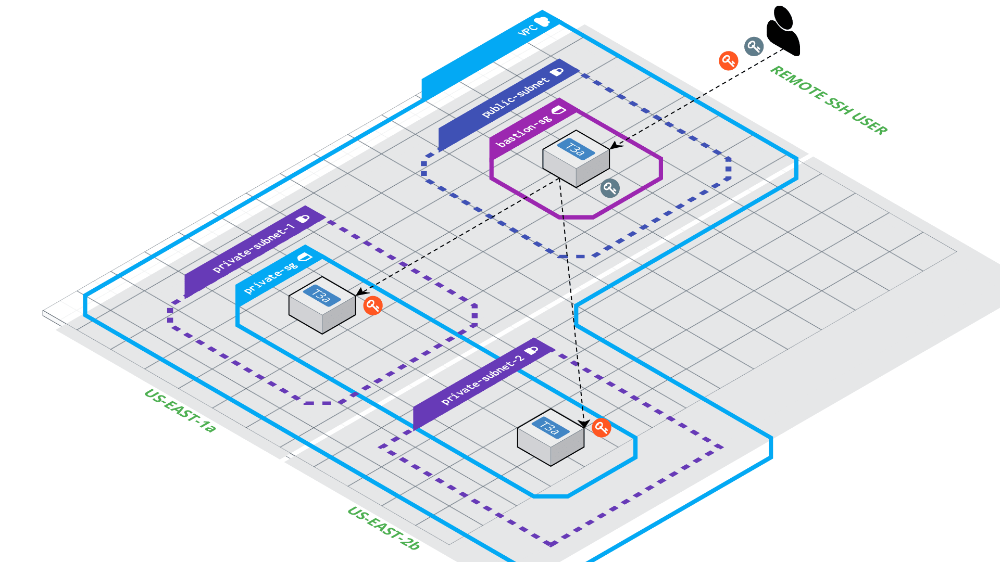

# terraform-aws-bastion-basic

This Terraform module creates a standardized public facing bastion instance. This basic configuration can be used to
Access Private resources (RDS, EC2) using ssh Tunneling


NOTE: This image depicts extra EC2 resources for demonstration only. Module only creates the public facing bastion.

## Supported Resources

The follow resource are created:

- EC2 Bation Resources
- Bastion Security Group

## Motivation

Access resources that are designated within private subnets usually require some initial access to configure and validate.
To Accomplish this, we can use a simple bastion host to tunnel our ssh connection through

## Supported Features

- Public Facing Bastion Host

## Technology

- terraform >0.13
- AWS EC2
- AWS Security Group

## Requirements

- terraform >0.13
- AWS credentials configured i.g. AWS IAM user credentials, Gitlab runner/Jenkins Build server with IAM role and
  appropraite permissions
- AWS Key Pair Previously Created

## Usage

To use the module follow the code snippets below and referenced variables

## Simple Public Facing Bastion

_main.tf_

```hcl
module "sample_bastion_instance" {
  source               = "github.com/terraform-aws-iac/terraform-aws-bastion-basic.git?ref=1.0.0"
  bastion_instance_key = var.bastion_instance_key
  vpc_id               = var.vpc_id
  subnet_id            = var.subnet_id
  environment          = var.environment
  tags                 = var.tags
}
```

_terraform.tfvars_

```hcl
bastion_instance_key = var.bastion_instance_key
vpc_id               = var.vpc_id
subnet_id            = var.subnet_id
environment          = var.environment
tags                 = {Key = "value",Key = "value"}
```

After the resources are created, you must update your application and or database security groups to accept inbound
TCP(ssh) 22 traffic from the Bastion Security group ID.

The default inbound rule on the created security group resources has been set to 0.0.0.0/0 as an origin. This was set
as a placeholder and should be changed accordingly to your public facing IP CIDR

### Application inbound rule

| Type | Protocol | Port range | Destination     | Description                                  |
| ---- | -------- | ---------- | --------------- | -------------------------------------------- |
| SSH  | TCP      | 22         | sg-123abc123abc | Allow inbound connections for bastion access |

### Bastion inbound rule

| Type | Protocol | Port range | Source      | Description                          |
| ---- | -------- | ---------- | ----------- | ------------------------------------ |
| SSH  | TCP      | 22         | 70.1.3.4/32 | Allow inbound connections from my IP |

## Variables

| Name                 | Description                                                           | Type        | Default | Required |
| -------------------- | --------------------------------------------------------------------- | ----------- | ------- | -------- |
| environment          | The defining environment of the Account: DEV, TST, STG, PRD, ROOT     | string      | null    | yes      |
| vpc_id               | Desired VPC ID for Instance Creation                                  | string      | private | yes      |
| bastion_instance_key | The desired previously created key pair name for the bastion instance | string      | null    | no       |
| subnet_id            | The desired public subnet to create bastion instance                  | string      | null    | no       |
| tags                 | Additional Tags to apply to resources                                 | map(string) | null    | no       |

## Outputs

| Name                       | Description                                  |
| -------------------------- | -------------------------------------------- |
| bastion_instance_id        | The name of the bucket                       |
| bastion_instance_arn       | The Amazon Resource Name (ARN) of the bucket |
| bastion_security_group_id  | The ID of the bastion security group         |
| bastion_security_group_arn | The ARN of the bastion security group        |
